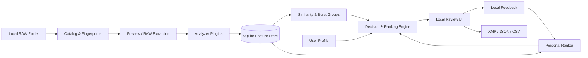

# System Design

本文档同时描述产品高层设计和当前计划的低层实现。它是架构边界，不是对尚未实现功能的
承诺；实现状态以 `ROADMAP.md` 为准。

## 1. Goals

- 照片、反馈、特征和个人模型默认完全留在本机
- 用户可以定义硬规则和显式权重，模型只学习未明确表达的偏好
- 复用可替换的预训练模型，不训练新的通用视觉基础模型
- 对相似照片进行组内比较，不依赖跨场景的单一绝对审美分
- 每个推荐都能区分规则、显式设置、客观证据和学习偏好
- 分析可缓存、增量执行、取消、恢复和复现
- 原始 RAW 永不修改；下游集成使用 sidecar 或显式导出

## 2. Non-goals

- 不替代 Lightroom、Capture One 或完整 DAM
- 不承诺一个适用于所有摄影类型的“客观美学真值”
- 不自行训练人脸、主体、审美或视觉语言基础模型
- 不默认上传照片、embedding、反馈或匿名统计
- 不让个人偏好覆盖用户定义的硬性规则

## 3. Decision hierarchy

所有照片决策使用固定优先级：

```text
hard rules
    > explicit profile weights
    > learned local preference
    > generic prior
```

例子：如果 Profile 将“严重闭眼”设为淘汰，个人模型不能因为喜欢该构图而把照片重新推荐；
如果用户关闭闭眼标准，系统也不能暗中继续使用它。

## 4. High-level architecture



### Components

- **Catalog**：发现文件、建立稳定 ID、检测新增/修改/删除
- **Preview Pipeline**：优先读取 RAW 内嵌 JPEG，必要时回退到受控显影
- **Analyzer Plugins**：生成独立 CriterionResult，不直接决定保留或淘汰
- **Feature Store**：持久化结果、版本和证据，负责缓存失效
- **Grouping Engine**：基于时间、EXIF、哈希和 embedding 建立相似组
- **Profile Engine**：解析硬规则、显式权重、启用插件和成本限制
- **Personal Ranker**：根据本地反馈训练小型排序模型
- **Decision Engine**：执行优先级、融合组内分数并生成解释
- **Review UI**：展示比较、置信度、解释和纠正入口
- **Exporter**：生成 sidecar 或清单，永不修改 RAW 原文件

## 5. Core domain model

### Photo

```text
Photo
  id: stable content/file identity
  path: current absolute path
  size: bytes
  mtime_ns: integer
  fingerprint: sampled content hash
  format: ARW | DNG | JPEG | ...
  capture_time: optional datetime
  camera/lens/exposure: optional EXIF
  orientation: 0 | 90 | 180 | 270
```

路径不是唯一身份；移动文件后，指纹用于重新关联已有分析和反馈。

### CriterionDefinition

```text
CriterionDefinition
  id: namespaced stable identifier
  kind: hard_rule | soft_weight | learned_feature
  value_type: boolean | score | category | vector
  cost: cheap | medium | expensive
  required_plugin: optional plugin id
  default_enabled: boolean
  version: semantic version
```

### CriterionResult

```text
CriterionResult
  photo_id
  criterion_id
  value
  normalized_score: optional 0..1
  confidence: 0..1
  evidence: JSON
  analyzer_version
  computed_at
```

`evidence` 可以包含剪裁比例、检测框、组内百分位或警告，但不能只保存一句不可计算的解释。

### Profile

```text
Profile
  id
  name
  hard_rules: criterion -> action/threshold
  weights: criterion -> 0..1
  enabled_plugins
  preference_model_id
  created_at / updated_at
```

### SimilarityGroup

```text
SimilarityGroup
  id
  type: duplicate | burst | related
  member_photo_ids
  confidence
  manually_corrected: boolean
```

### Feedback

```text
Feedback
  id
  profile_id
  group_id: optional
  preferred_photo_id: optional
  rejected_photo_id: optional
  decision: keep | reject | prefer_a | prefer_b
  reason_criteria: optional list
  created_at
```

### PreferenceModel

```text
PreferenceModel
  id
  profile_id
  algorithm
  feature_schema_version
  training_feedback_ids
  parameters_blob
  validation_metrics
  updated_at
```

## 6. Plugin contract

第一版使用 Python protocol；跨进程或第三方插件稳定后再定义 RPC。

```python
class AnalyzerPlugin(Protocol):
    id: str
    version: str
    criteria: tuple[CriterionDefinition, ...]

    def available(self, environment: RuntimeEnvironment) -> Availability: ...
    def analyze(self, photo: PhotoInput, context: AnalysisContext) -> list[CriterionResult]: ...
```

约束：

- 插件只读照片输入，不写原文件
- 输出必须带版本和置信度
- 缺少模型或硬件时返回明确的 unavailable/degraded 状态
- 网络访问默认禁止；需要网络的插件必须单独授权
- 插件升级后只失效其负责的 CriterionResult

## 7. Analysis and cache flow

```text
scan folder
  -> calculate cheap file identity
  -> lookup catalog
  -> unchanged: reuse preview/features
  -> changed/new: enqueue preview extraction
  -> run enabled cheap plugins
  -> run optional expensive plugins according to profile
  -> update groups affected by changed photos
  -> rerank affected groups
```

缓存键至少包含：

```text
photo fingerprint
+ analyzer/plugin id and version
+ criterion schema version
+ relevant profile parameters
```

缩略图旋转和 UI 状态不应导致照片重新分析。

## 8. Ranking design

### Hard-rule pass

每条规则输出 `pass`、`warn`、`reject` 或 `unknown`。`unknown` 不能自动当作 `reject`。

### Explicit score

```text
explicit_score = weighted_mean(enabled criterion scores with sufficient confidence)
```

低置信度标准降低贡献或仅显示警告；不把缺失值当作零分。

### Personal preference score

输入只使用：

- 冻结视觉 embedding
- 客观 CriterionResult
- EXIF
- 组内相对差值
- 当前 Profile 的历史反馈

当前实现：

1. 固定 73 维 feature schema：11 项技术指标、5 项可选标准、5 项组内百分位、4 项
   归一化 EXIF 和 48 维冻结描述符
2. 正负反馈组合为 pairwise difference，使用 L2 正则的线性 logistic ranker
3. 每次反馈后在 CPU 重训，最多采样 512 对；不足 2 个正例和 2 个负例时不建立模型
4. 模型按 Profile 以版本化 JSON 存入 `preference_models`；不兼容 schema 自动回退先验
5. `learned_weight` 同时受反馈数量和 pairwise 一致率限制，范围为 0–40%

Alaska 缓存基准中，读取 1,065 条缓存分析记录的模型上下文约 52 ms，20 条模拟反馈训练
约 10 ms，全部预测约 8 ms；序列化模型约 1 KB。具体耗时随机器与缓存状态变化。

### Final group ranking

```text
eligible = photos not rejected by hard rules
final_score = explicit_weight * explicit_score
            + learned_weight * preference_score
            + prior_weight * generic_prior
```

`learned_weight` 随有效反馈量和验证表现增加；个人模型未超过基线时，不提高其权重。

### Active feedback and evaluation

下一组候选以 60% 当前推荐质量、25% 个人模型不确定性和 15% embedding 场景多样性进行
贪心选择。没有个人模型时不伪造不确定性，只使用质量和多样性。反馈按稳定路径顺序做
75/25 本地拆分，报告通用先验、显式 Profile 和个人模型的 pairwise accuracy、Top-5 hit
rate、NDCG、95% bootstrap 区间，以及 5/10/20/50 条反馈学习曲线。匿名统计设置默认
`off`，当前版本没有任何上传实现。

## 10. Non-destructive workflow

JSON/CSV 是可移植的选择清单。Lightroom/Capture One 集成通过同名 `.xmp` sidecar 交换
rating、label 和 pick/reject，不修改 RAW。复制、硬链接、符号链接和 XMP 都先序列化为
`FileAction[]`；目标存在时标记 conflict。执行结果写入版本化审计 JSON，撤销只删除该
审计记录中由本次操作创建的文件，且重复撤销为无操作。

## 9. Explanation design

解释由结构化决策记录生成，不由语言模型猜测：

```text
Recommended within this burst because:
- eye focus ranks 1/8
- highlight recovery ranks 2/8
- matches the active Portrait profile's high expression weight
- personal preference contributed +0.08 with medium confidence
```

必须同时显示重要负面证据和 `unknown`，避免只解释支持推荐的部分。

## 10. Local learning and evaluation

- 每个 Profile 拥有独立模型
- 训练任务在本机执行，默认 CPU 轻量运行
- 使用时间或组级拆分，避免同一连拍泄漏到训练和测试两侧
- 少量反馈时使用正则化和先验
- 本地报告 baseline 与 personalized 的 pairwise accuracy、Top-K hit rate 和 NDCG
- 只有在用户明确 opt-in 后才可导出匿名聚合指标

## 11. Storage design

计划的 SQLite 表：

```text
photos
previews
criterion_definitions
criterion_results
profiles
profile_rules
profile_weights
plugins
similarity_groups
group_members
feedback
preference_models
analysis_jobs
export_jobs
```

大对象策略：缩略图和模型文件存磁盘，SQLite 保存路径、hash 和元数据；小型模型参数可直接保存在
BLOB 中。

数据库启用 WAL。所有 schema 变化通过版本化 migration，不在请求处理中隐式修改结构。

## 12. Local API boundary

本地服务只监听 `127.0.0.1`。计划 API：

```text
POST /api/catalogs/scan
GET  /api/jobs/{id}
POST /api/jobs/{id}/cancel
GET  /api/groups
GET  /api/groups/{id}
POST /api/feedback
GET  /api/profiles
POST /api/profiles
PUT  /api/profiles/{id}
POST /api/models/{profile_id}/train
GET  /api/models/{profile_id}/evaluation
POST /api/exports/xmp
```

长任务返回 job ID，由 UI 轮询或使用 server-sent events；HTTP 请求不应阻塞整个分析过程。

## 13. Privacy and safety

- 默认无网络请求和遥测
- 原片只读打开
- 删除、移动、sidecar 写入和导出均需明确用户操作
- 文件夹路径、EXIF、embedding、反馈和模型均视为本地敏感数据
- 插件声明所需文件、网络和模型权限
- 日志不记录完整照片内容、embedding 或无必要的绝对路径

## 14. Testing strategy

- 单元测试：指纹、缓存键、规则优先级、缺失值、排序和解释
- 数据库测试：migration、并发读取、任务恢复和缓存失效
- 合约测试：每个插件的 schema、置信度和降级状态
- 集成测试：RAW -> preview -> criteria -> group -> rank -> feedback -> rerank
- 回归集：用户本地维护，默认不提交照片到仓库
- 性能测试：冷启动、热缓存、单张成本、355 张目录和内存峰值

## 15. Near-term implementation slices

### Slice 1 — Persistent catalog

- `photos`、`previews`、`criterion_results`、`analysis_jobs`
- 文件指纹和 analyzer version
- 缓存命中/失效测试

### Slice 2 — Profile foundation

- `CriterionDefinition`、`CriterionResult` 和 `Profile`
- 将现有九项手工指标迁移为默认插件
- 实现规则优先级测试

### Slice 3 — Grouping baseline

- EXIF 时间窗口 + 感知哈希
- 人工修正和组内选择数据

所有后续模型和 UI 工作必须建立在这三个 slice 之上。
