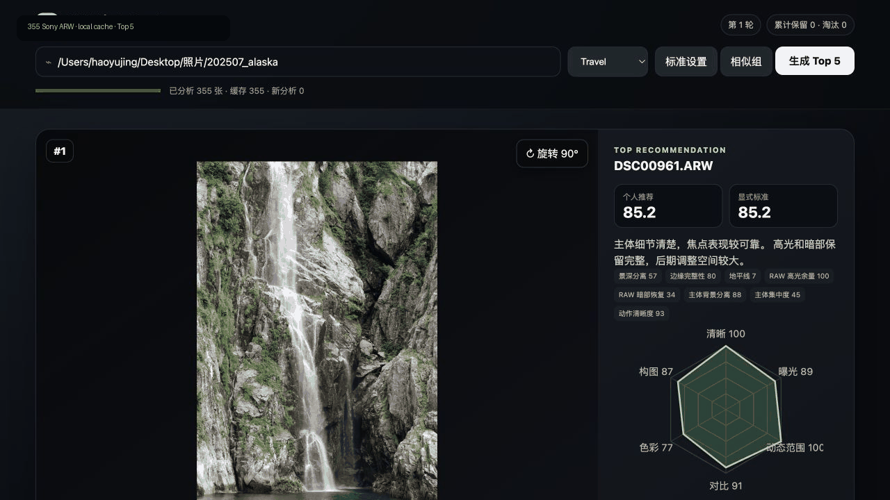

# RAW Photo Curator



[English](README_EN.md) · 中文

一个本地优先的 RAW/照片选片工具。它扫描文件夹，为每张照片分别计算：

- **保留分**：清晰度、曝光、构图代理指标与独特性
- **调色潜力**：高光/阴影保留、对比度与主体可用性

当前版本是可解释的 MVP，不上传照片，也不会删除或移动原片。支持 Sony ARW（通过
LibRaw/rawpy）以及 JPEG、PNG、TIFF。

项目方向和架构边界见 [ROADMAP.md](ROADMAP.md) 与 [DESIGN.md](DESIGN.md)。

## 安装

需要 Python 3.10+：

```bash
./scripts/bootstrap.sh
```

macOS 开发应用可运行 `pip install -e '.[packaging]'` 后执行 `./scripts/build_macos.sh`，产物
位于 `dist/RAWPhotoCurator.app`。双击后选择照片文件夹即可打开本地工作台；公开分发前仍需
按 [发布文档](docs/RELEASE.md) 使用 Apple Developer ID 签名和公证。

## 使用

```bash
raw-curator analyze /path/to/photos --output reports/latest
```

完成后打开 `reports/latest/index.html`。分析使用最长边 1600px 的预览，不修改原文件。

推荐使用本地交互式工作台。每次评价会立即写入本地 SQLite：

```bash
raw-curator serve /path/to/photos --output reports/live
```

然后访问 `http://127.0.0.1:8765`。服务只监听本机，不会上传照片。

照片索引、客观特征和缩略图会写入输出目录的 `catalog.sqlite3`。未变化的照片再次扫描时
直接命中缓存；文件内容、大小或修改时间变化后会自动重算。Alaska 测试集 355 张 ARW 的
第二次扫描为 355/355 缓存命中。

交互采用动态 Top 5：输入文件夹后完成全量初筛；“保留”的照片停留在候选池，“淘汰”
的照片立即由下一张推荐补位。保留满 5 张后进入下一轮，已保留和已淘汰照片都会被排除，
并使用累计反馈重新计算个人推荐分。

顶部可以切换 Travel、Portrait、Landscape、Wildlife 和 Custom 选片标准。Profile 的显式
权重会直接改变推荐先验；硬规则始终先于本地学习偏好执行。

“连拍选最佳”使用拍摄时间、相机序列、感知哈希和本地视觉描述符识别近似重复与连拍。
界面一次只显示一组；点击最想保留的一张后自动进入下一组，不要求用户理解聚类的合并、
拆分等内部概念。底层分组纠正 API 仍保留给评测与高级工作流。

可以复制 `docs/group-labels.example.json` 建立本地人工分组标注，并报告 pairwise
precision、recall 和 F1：

```bash
raw-curator evaluate-groups reports/live/catalog.sqlite3 my-group-labels.json
```

```bash
raw-curator analyze /path/to/photos --output reports/latest --limit 50
```

## 当前评分

- 清晰度 22%：灰度梯度强度
- 构图代理 18%：边缘干扰惩罚与中心区域信息量
- 曝光 12%：亮度均值与中间调偏差
- 高光保留 8%、阴影保留 6%：接近剪裁的像素比例
- 对比度 7%：5%–95% 亮度分位范围
- 噪声代理 7%：低变化区域的局部残差
- 色彩信息 5%：饱和度及色彩变化
- 白平衡代理 5%：RGB 通道均值偏差
- 独特性预留 10%：后续用于连拍/重复照片惩罚

固定权重是可解释的初始先验，不是普适审美定律。每个 Profile 使用技术指标、冻结的
48 维视觉描述符、EXIF、可选标准和组内百分位训练强正则 pairwise logistic ranker。
至少有 2 张正例和 2 张负例才建立个人模型；随后按反馈量和模型一致率，将学习偏好逐步
混入排序，最高 40%。模型、特征和反馈只写入本地 SQLite；可在“标准设置”中查看、导出、
导入或重置当前 Profile 的模型。
- 独特性：基于感知缩略图的近似重复惩罚

这些分数用于初筛，不代表审美判断。连拍分组已经参与组内比较；主体、景深、人脸/表情与
通用审美先验均通过独立插件接入，不会被基础代理指标冒充。

每项客观标准同时保存置信度、结构化证据、分析器版本和组内百分位。RAW 高光余量与暗部
恢复使用传感器线性抽样，仅对高排名候选按需计算；未计算或不可用时显示“未知”，不会按
零分参与排序。

“标准设置”显示每个分析器的运行成本、下载体积、安装状态与隐私边界。主体显著性、背景
分离、景深和动作时机代理无需下载；可选模型使用
`pip install -e '.[vision]'` 后，再以 `raw-curator install-model face` 或
`raw-curator install-model aesthetic` 显式下载并校验。眼睛被遮挡、太小或证据不足时，
眼睛对焦与闭眼返回 unknown，不会自动淘汰。新启用的插件独立补算自己的 Criterion，
不会使已有基础分析缓存失效。模型来源、许可提示和局限见 `docs/MODELS.md`。

## 下游工作流

选片清单可以导出为 JSON 或 CSV；XMP 使用 Adobe 标准的 `xmp:Rating`、`xmp:Label` 与
Camera Raw `crs:Pick`，只创建 sidecar，绝不修改 RAW。先生成计划、检查冲突，再执行并
保留审计日志：

```bash
raw-curator export reports/live/feedback.sqlite3 selection.json --profile travel
raw-curator plan-xmp selection.json --output xmp-plan.json
raw-curator apply-plan xmp-plan.json --audit xmp-audit.json

raw-curator plan-files selection.json selected/ --method hardlink --output file-plan.json
raw-curator apply-plan file-plan.json --audit file-audit.json
raw-curator undo file-audit.json
```

计划中已有目标文件会标记为 `conflict` 并跳过，不会覆盖。`copy`、`hardlink` 和 `symlink`
使用相同的预览、审计与撤销流程。

## 本地验收

实现完成与真实用户验收分开记录。下面的命令检查照片数量、缓存覆盖、失败任务、Criterion
覆盖、真实反馈、人工分组纠正和个人模型；证据不足会明确输出 `missing`：

```bash
raw-curator acceptance reports/alaska-cache-validation --expected-photos 355
```

加入 `--group-labels grouping-labels.json` 后还会报告人工标注集上的分组 precision/recall。
格式与验收边界见 `docs/ACCEPTANCE.md`。

真实反馈的个人排序留出评测不依赖正在运行的服务器：

```bash
raw-curator evaluate-personal reports/alaska-cache-validation --profile travel
```

## 隐私

所有处理默认在本机完成。生成的报告只包含缩略图和分析数据。
