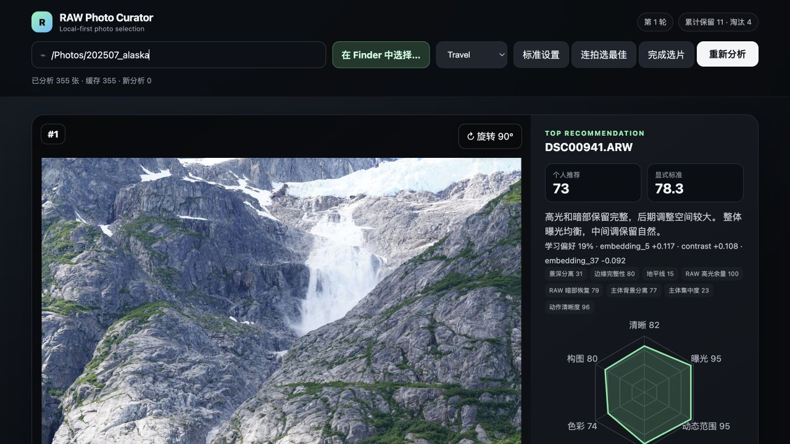
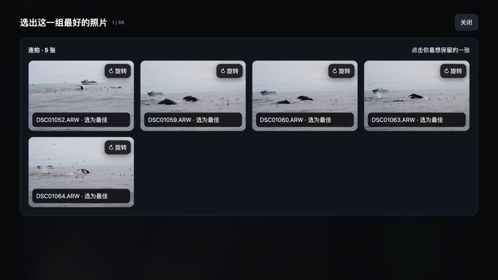
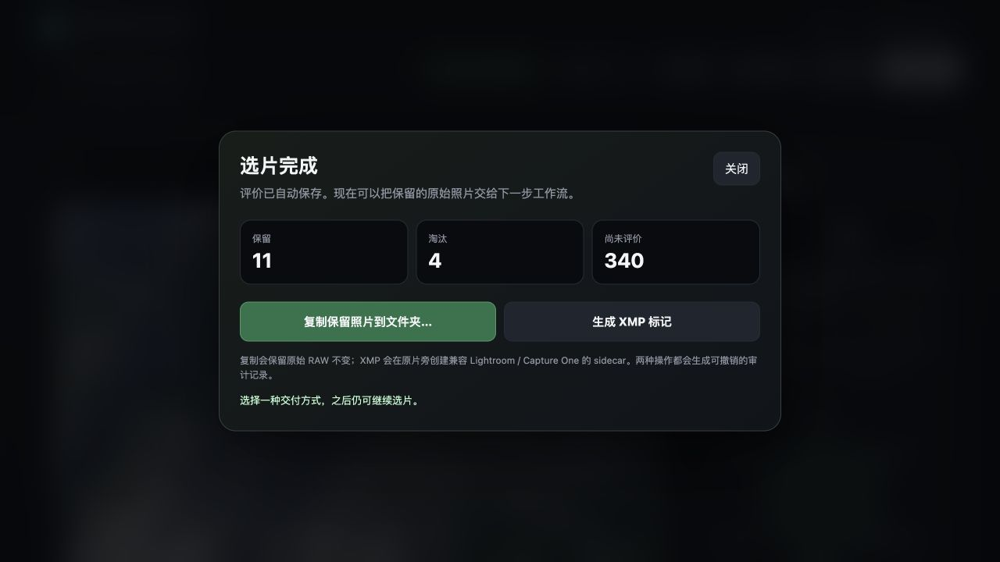

# RAW Photo Curator


| Dynamic Top 5 | Best frame in a burst | A clear finish state |
| --- | --- | --- |
|  |  |  |

[中文](README.md) · English

Local-first, explainable photo culling for Sony ARW and common image formats. Choose a folder in
Finder, get five recommendations, keep or reject, and let a lightweight on-device ranker learn your
preferences. Photos, previews, scores, and feedback stay on your Mac.

> Private alpha. The first downloadable macOS build is produced by the release workflow; no Python
> setup is required for release users.

## Download for macOS

[Download the latest release](https://github.com/hyjing/raw-photo-curator/releases/latest), open the
DMG, and drag **RAW Photo Curator** to Applications. Until the app is signed and notarized, macOS may
require Control-click → Open. See [release and signing notes](docs/RELEASE.md).

## The workflow

1. Click **Choose in Finder** and select a folder containing ARW, JPEG, PNG, or TIFF photos. Analysis
   starts automatically and is cached for subsequent runs.
2. Review the large Top 5 cards. A rejection is replaced immediately; five keeps finish a round and
   train the per-profile preference model before the next round.
3. Click **Finish culling** at any time. Copy kept originals to another folder or generate
   Lightroom/Capture One-compatible XMP sidecars. RAW bytes are never modified, existing files are
   never overwritten, and every export has an audit record.

The hexagonal chart explains sharpness, exposure, dynamic range, contrast, color, and composition.
Travel, Portrait, Landscape, Wildlife, and Custom profiles provide explicit starting standards.
Burst review presents one related set at a time and asks only for the best frame.

## Why it is technically interesting

- incremental, versioned SQLite feature cache for RAW workflows;
- objective criteria with confidence, evidence, cost, and graceful degradation;
- time/EXIF/perceptual-hash/local-descriptor burst grouping with persisted corrections;
- strongly regularized pairwise personalization, isolated per profile;
- active Top 5 selection balancing rank, uncertainty, and visual diversity;
- reproducible holdout metrics and acceptance reports;
- audited JSON/CSV/XMP/copy/link exports with conflict protection and undo support.

Read [System Design](DESIGN.md), [Roadmap](ROADMAP.md), [Plugin SDK](docs/PLUGIN_SDK.md),
[Privacy](docs/PRIVACY.md), [Performance](docs/PERFORMANCE.md), and
[Models & limitations](docs/MODELS.md).

## Developer setup

Requires Python 3.10+:

```bash
./scripts/bootstrap.sh
.venv/bin/raw-curator serve /path/to/photos --output reports/live
```

Open `http://127.0.0.1:8765`. To build the macOS app or complete release artifacts:

```bash
.venv/bin/pip install -e '.[packaging,vision]'
./scripts/build_macos.sh
./scripts/package_macos_release.sh v0.2.0
```

Optional models are explicit, pinned downloads: `raw-curator install-model face` and
`raw-curator install-model aesthetic`. Evidence that cannot be measured remains unknown rather than
being treated as a failure.

## Safety and privacy

The server listens only on `127.0.0.1`. No cloud account or upload is required. Exports use a
plan/apply/audit workflow, skip conflicts, and can be undone from the recorded audit file.

## License

See [LICENSE](LICENSE).
